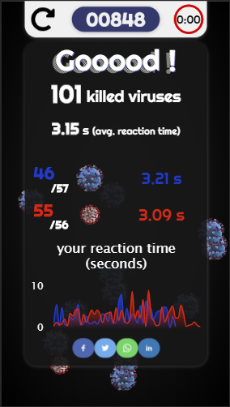

# Catch me

Catch me is a small proof-of-concept game built with basic html/css Vanilla JS and some javascript libraries.
It is a reactivity / speed game where you need to tap as much items as you can in under 60 seconds.

The items are represented by Covid viruses, since this game was coded during the first lockdown.
It is a result of a personal challenge where I wanted to code a game in a single weekend.

Some parts (timer, countdown) where taken from other opensource proof-of-concepts.

## Live demo

You can access a live demo [here](https://athmanetadjine.com/catchme)

Eventhough it is playable on smartphones and desktop, the gameplay is better on smartphones.

## Description

The game tracks your reactivity and displays at the end :

- Your overall score
- Your average reaction time in seconds
- Your successful kills
- The graph of the evolution of your reaction time

The reaction time is defined as the duration between the moment a virus appears on screen, and the moment you kill it by tapping on it. The score you get is inversely proportional to you reaction time.

This means that you get more points if you tap the viruses as soon as they appear.

Red viruses are smaller than blue ones, which makes them harder to kill. Therefore, killing a red virus will give you more points than a blue one.

## Credits

Countdown timer : [Mateusz Rybczonec](https://css-tricks.com/how-to-create-an-animated-countdown-timer-with-html-css-and-javascript/)

Ready timer : unknown

Track: THYKIER - INTENSIFY [NCS Release]
Music provided by NoCopyrightSounds.
[Watch on YouTube](https://youtu.be/cDVR6OtP9WI​)
[Free Download / Stream](http://ncs.io/EPTHELIMIT)
